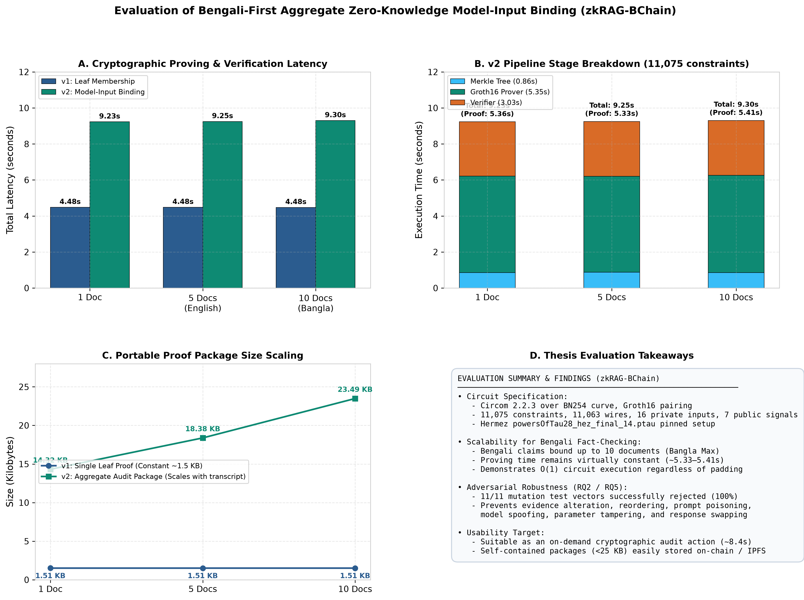
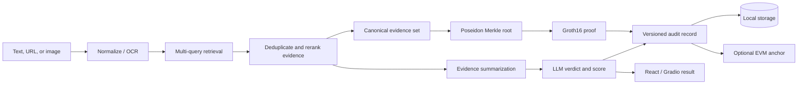
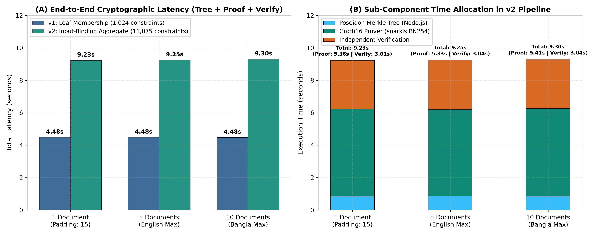
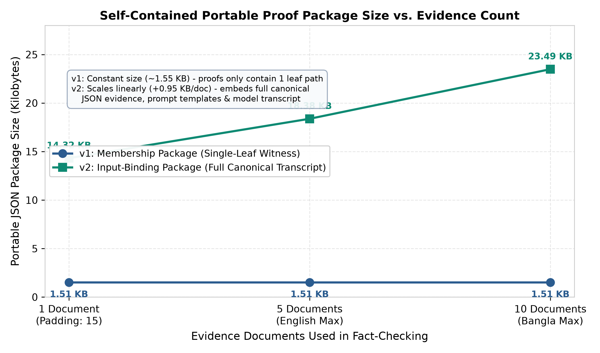
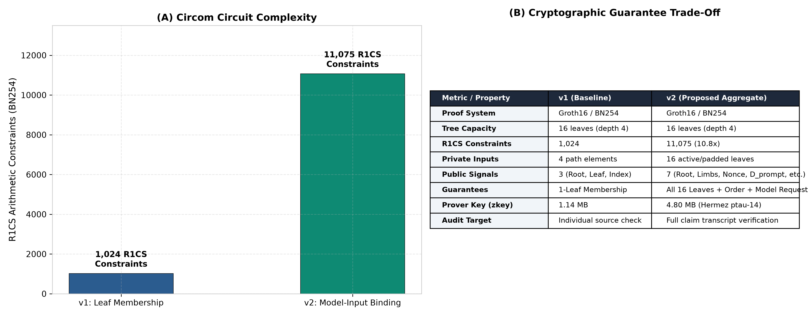
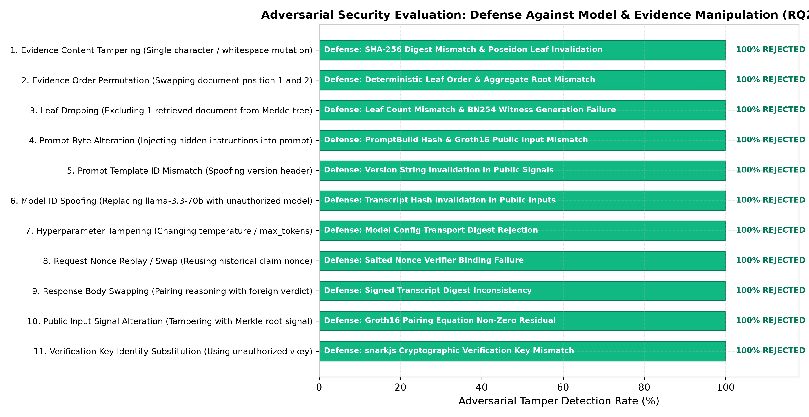

# Bangla FactCheck zkRAG

[](https://github.com/Saiful-Islam0/bangla-fact-check-zkrag/actions/workflows/ci.yml)


A Bangla-first, multimodal fact-checking research platform that combines retrieval-augmented generation (RAG), evidence-bound zero-knowledge proofs, and optional blockchain anchoring. It accepts Bangla or English text, article URLs, and images, then returns an evidence-grounded verdict with an auditable provenance record.

> Research prototype: outputs support investigation and reproducibility; they are not a substitute for professional fact-checking or independent source verification.



## Highlights

- Bangla-first retrieval with English support and multi-query evidence gathering.
- Shared text, URL, and image pipeline with OCR and optional image captioning.
- Evidence-grounded LLM verdicts with credibility scores and explanations.
- Poseidon Merkle commitments and Groth16 membership/input-binding proofs.
- Versioned audit records with optional local EVM anchoring.
- React 19 frontend, FastAPI backend, Gradio fallback, and Docker deployment.
- Included dataset, benchmark outputs, evaluation figures, and thesis documentation.

## System architecture



The proof establishes evidence membership and deterministic evidence-to-input binding. It does **not** prove that a source is true, retrieval is complete, a provider executed a declared model, or the verdict itself is factually correct.

## Repository map

| Path | Purpose |
| --- | --- |
| `code/` | FastAPI and Gradio applications, verification pipeline, storage, and tests |
| `bangla-fact-check-main/` | React 19 + Vite + Tailwind frontend |
| `zk/` | Circom circuits, proof tooling, verification artifacts, benchmarks, and figures |
| `blockchain-anchor/` | Solidity contract, Hardhat tests, and EVM bridge |
| `Dataset/` | Bangla fake-news research dataset |
| `results.json` | Full empirical evaluation output |
| `sn-article.md` | Research manuscript |
| `REPORT.md` | End-to-end project report |

## Quick start with Docker

Prerequisites: Docker Desktop or Docker Engine with Compose.

```bash
git clone https://github.com/Saiful-Islam0/bangla-fact-check-zkrag.git
cd bangla-fact-check-zkrag
cp .env.example .env
```

Add the API keys you intend to use to `.env`, then run:

```bash
docker compose up --build
```

Open <http://localhost:8000>. The first startup can take longer while OCR and transformer models are downloaded into persistent Docker volumes.

## Local development

### Backend

```bash
python3.11 -m venv .venv
source .venv/bin/activate
pip install -r code/requirements.txt
cp .env.example .env
python code/api.py
```

The API is available at <http://localhost:8000>; interactive documentation is at <http://localhost:8000/docs>.

### Frontend

```bash
cd bangla-fact-check-main
npm ci
npm run dev
```

Vite normally starts at <http://localhost:5173> and proxies `/api` requests to the backend.

### Legacy Gradio interface

```bash
python code/app.py
```

## Zero-knowledge setup and verification

Requirements: Node.js 20 LTS, Circom 2.2.3, `curl`, and `openssl`.

```bash
cd zk
npm ci
./scripts/setup.sh
./scripts/setup_input_binding.sh
```

The setup scripts download checksum-pinned Powers of Tau files and rebuild the proving artifacts. Verification keys and reproducibility checksums are committed; downloaded ceremony files are intentionally excluded.

After a fact check, the API supports:

- `POST /api/zk/proofs` for a portable evidence-membership proof.
- `POST /api/zk/input-proofs` for a full ordered-set input-binding proof.
- `POST /api/zk/verify` for package verification.

See [zk/README.md](zk/README.md) for the protocol, security boundary, and standalone verifier.

## Optional blockchain anchor

```bash
cd blockchain-anchor
npm ci
npm run test
npm run chain
```

In separate terminals, deploy the contract and run the bridge:

```bash
npm run compile
npm run deploy
cp .env.example .env
npm run bridge
```

The checked-in private key used by the local Docker/Hardhat workflow is Hardhat's publicly known development key. Never fund it or reuse it on a public network. Configure a private signer through environment variables for any non-local deployment.

## Evaluation and figures

The release includes raw results, methodology, and publication-ready figures:

| Artifact | Description |
| --- | --- |
| [Evaluation report](zk/THESIS_EVALUATION_REPORT.md) | Research questions, threat model, methodology, results, and limitations |
| [Full evaluation output](results.json) | RAG, robustness, ablation, and performance measurements |
| [ZK v1 benchmark](zk/benchmark_results.json) | Membership-proof benchmark data |
| [ZK v2 benchmark](zk/benchmark_results_v2.json) | Aggregate input-binding benchmark data |
| [Research manuscript](sn-article.md) | Thesis/article narrative and references |

<p align="center">
  
  
</p>
<p align="center">
  
  
</p>

Reproduce the main evaluations with:

```bash
python run_full_evaluation.py
python rag_benchmark.py
python zk/benchmark.py
python zk/benchmark_input_binding.py
python zk/scripts/generate_evaluation_figures.py
```

## Configuration and security

- Copy `.env.example`; never commit `.env` files or real credentials.
- Keep RPC credentials, signing keys, and production contract settings outside source control.
- Generated claims, snapshots, uploaded images, proofs, caches, and downloaded setup files are ignored.
- Review [SECURITY.md](SECURITY.md) before exposing the service publicly.

## Contributing

Contributions are welcome. See [CONTRIBUTING.md](CONTRIBUTING.md) for setup and validation commands.

## Documentation

- [Project report](REPORT.md)
- [Azure deployment guide](AZURE_DEPLOYMENT_GUIDE.md)
- [Image fact-checking notes](code/IMAGE_FACT_CHECKING_README.md)
- [ZK evaluation report](zk/THESIS_EVALUATION_REPORT.md)
- [Evaluation walkthrough](walkthrough.md)

## License

No open-source license has been granted yet. Source is available for review and academic reproducibility; contact the repository owner before reuse or redistribution.
